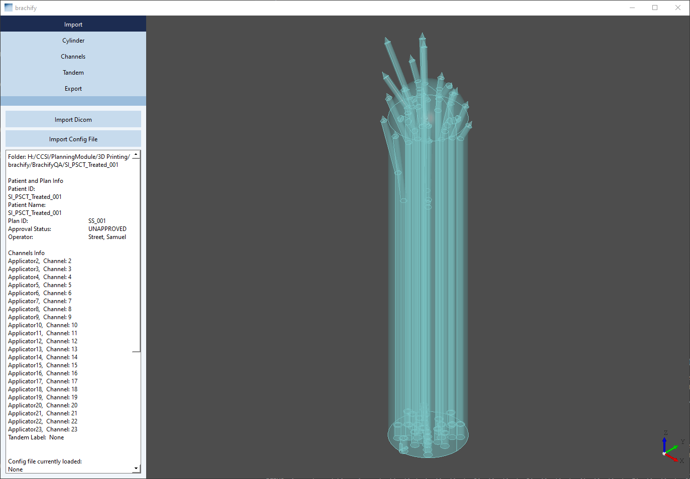
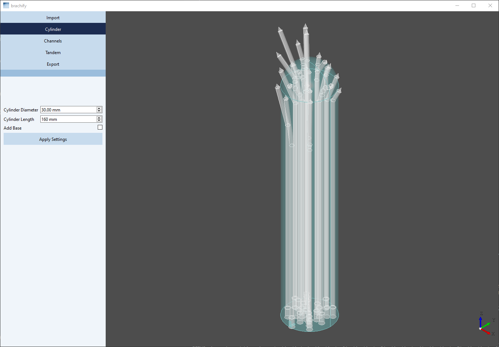
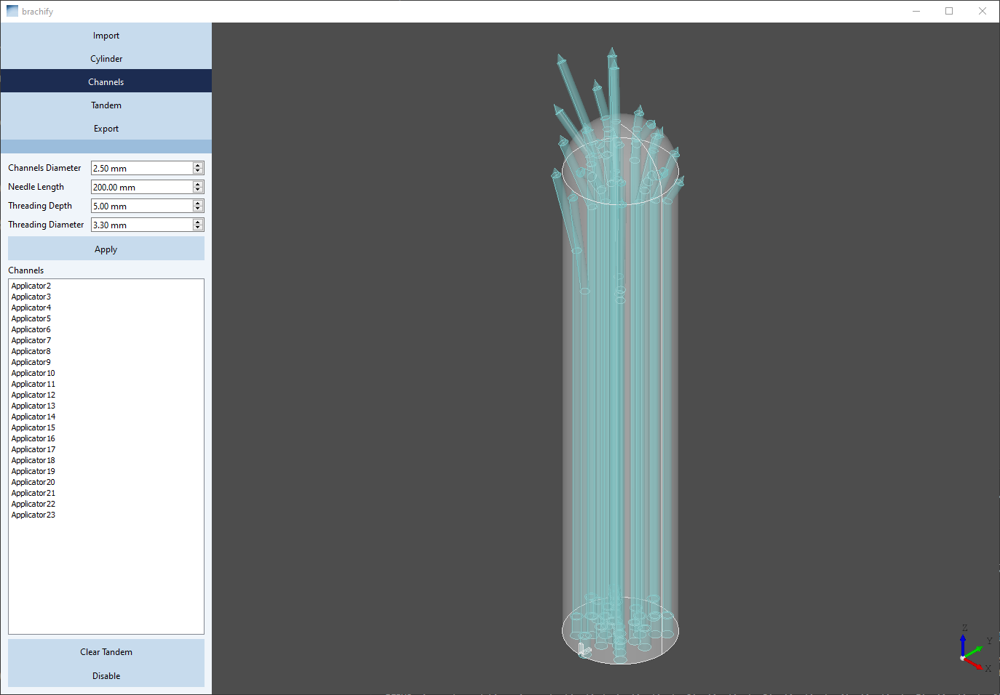
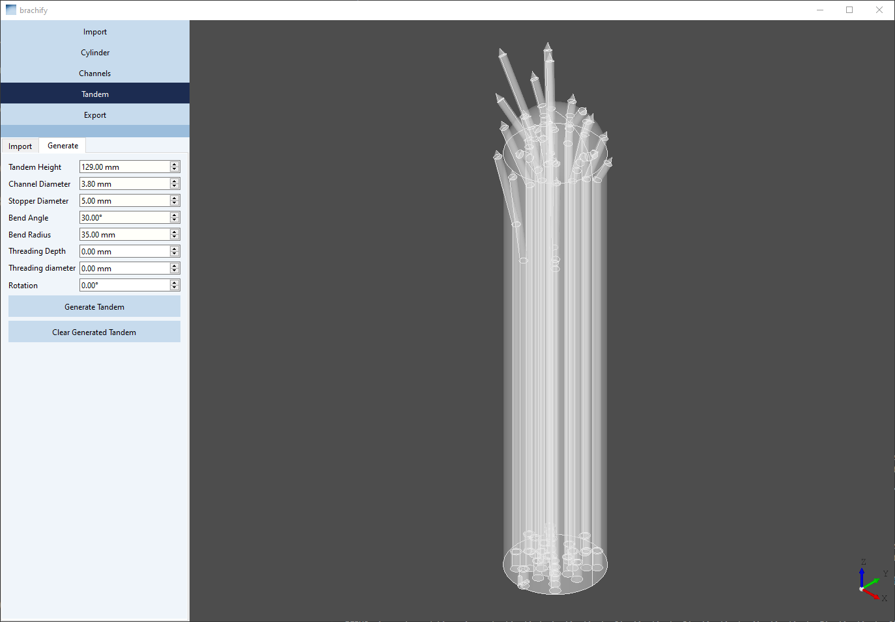
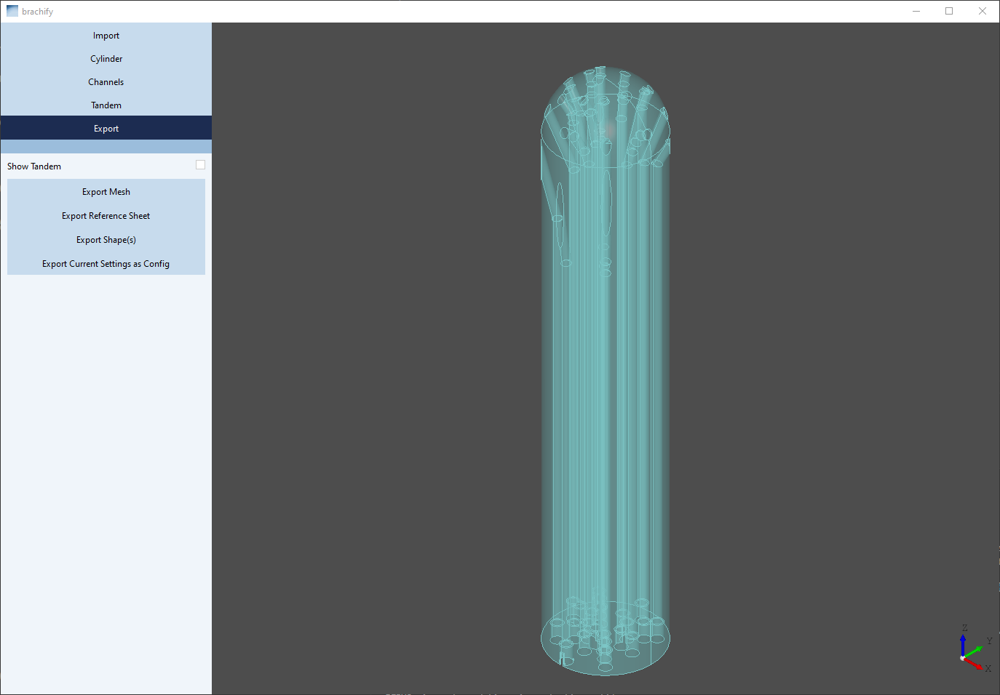

Thank you for checking out brachify - a software designed by Michael Kudla, Ph.D. ( Contact: michael.kudla AT bccancer.bc.ca ) for generating 3D printable cyliders for interstitial GYN brachytherapy!

You have found the release repository for brachify. You can go to https://github.com/brachify/brachify-release/releases for the latest release.

Brachify uses DICOM files to create 3D printable models for Brachytherapy plans created in Brachyvision or Oncentra.  
Below is a short how-to for using the program. If you would like more information please view the user guide at:
https://github.com/brachify/brachify-release/blob/main/user_guide/Brachify%20User%20Manual.docx

Generating your first cylinders: 
1) Download the most recent Brachify release from the website above https://github.com/brachify/brachify-release/releases .

2) Extract folder from the zip file you downloaded and inside of the folder created select the 'brachify.exe' file.

3) Press the Import Dicom button and navigate to find the folder you would like to import.
   The folder should contain:  
        1 DICOM RTPlan file you would like to use (exported from your TPS) AND  
        1 DICOM RTSTRUCT file associated with your RTPLAN file.

   Note: Ensure your DICOM plan/structure set files have the associated structure set in the same folder and a straight channel labeled 'Central Axis' with the tip of the needle      just touching the top of the cylinder and the bottom in line with the center of your cylinder -- this channel will be used to determine the cylinder central axis and tip           direction. It must be named "Central Axis".

5) Press 'Export Mesh' in order to get your .stl file and 'Export Refrence Sheet' in order to get a reference sheet for your cylinder

6) Navigate through the Cylinder, Channels, or Tandem tabs to modify your model as needed.

Import Page 
 
Cylinder Page 
 
Channels Page 
 
Tandem Page 
 
Export Page (final model preview)  
 

